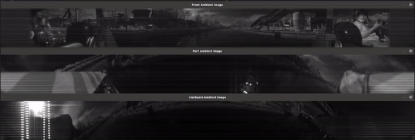

# ROS package for LiDAR to image of Pohang Canal Dataset



## Installation

```sh
$ cd <your catkin_workspace/src>
$ git clone git@github.com:dhchung/lidar_to_image.git
$ cd <your catkin_workspace> && catkin_make
```

## How to use

Run [rosmsg_player](https://github.com/dhchung/rosmsg_player).

```sh
$ rosrun lidar_to_image lidar_to_image_node
```
